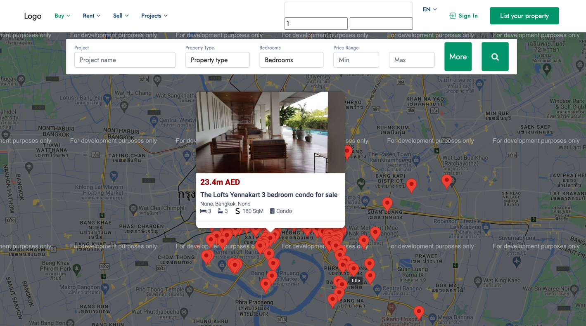

# Property Project


Experience luxury living like never before with our exclusive real estate platform tailored for the discerning clientele of Thailand. Dive into a world where opulence meets convenience, where every apartment is a masterpiece and every project a marvel of architectural brilliance.

Our platform transcends traditional real estate listings by offering a unique concept: apartments above apartments, projects above projects. Discover a diverse array of properties from leading companies, each boasting numerous projects that redefine urban living. Within each project, explore a plethora of meticulously designed apartments, each offering unparalleled comfort and sophistication.

But that's not all – our platform also caters to the needs of real estate agents, providing them with a seamless and efficient way to showcase their listings. With our user-friendly interface, agents can effortlessly upload a vast number of properties, whether it's one at a time or in bulk via JSON file, all asynchronously processed and swiftly integrated into our site.

Indulge in the epitome of luxury living and discover your dream home with us today. Welcome to a world of elegance, convenience, and endless possibilities.



## Getting Started

### 1. Using Git

- Clone the repository:

```bash
git clone https://github.com/sonik2001www/prop_project.git
```

### 2. Using Virtual environment

- Install virtualenv if you haven't already installed it with pip:

~~~
pip install virtualenv
~~~

~~~
virtualenv venv
~~~

- Activate the virtual environment. On UNIX or MacOS, this can be done as follows:

~~~
source venv/bin/activate
~~~

- On Windows:

~~~
venv\Scripts\activate
~~~


### 3. Install the requirements

- Run the following command to install all the required packages specified in the requirements.txt file:

```
pip install -r requirements.txt
```

- This command will automatically download and install all the packages listed in the requirements.txt file.


### 4. PostgreSQL Database Setup

#### MacOS:

- **Install PostgreSQL:**
   - Download the official PostgreSQL installer for MacOS from [the official website](https://www.postgresql.org/download/macosx/).
   - Follow the instructions to install PostgreSQL on your machine.

- **Create a Database:**
   - After installing PostgreSQL, open the Terminal.
   - Start the PostgreSQL command line by typing:
     ```
     psql -U postgres
     ```
   - Enter the password you set during the PostgreSQL installation (default password is usually blank).
   - To create a new database, type:
     ```
     CREATE DATABASE ytcom;
     ```

- **Create a User:**
   - To create a new user (e.g., root) with a password, type:
     ```
     CREATE USER root WITH PASSWORD '1234';
     ```
   - Grant all privileges to the user on the database:
     ```
     GRANT ALL PRIVILEGES ON DATABASE ytcom TO root;
     ```

#### Windows:

1. **Install PostgreSQL:**
   - Download the official PostgreSQL installer for Windows from [the official website](https://www.postgresql.org/download/windows/).
   - Follow the instructions to install PostgreSQL on your machine.

2. **Create a Database:**
   - After installing PostgreSQL, open Command Prompt or SQL Shell (psql).
   - Start the SQL Shell (psql) and log in with the username and password you set during the installation.
   - To create a new database, type:
     ```
     CREATE DATABASE ytcom;
     ```

3. **Create a User:**
   - To create a new user (e.g., root) with a password, type:
     ```
     CREATE USER root WITH PASSWORD '1234';
     ```
   - Grant all privileges to the user on the database:
     ```
     GRANT ALL PRIVILEGES ON DATABASE ytcom TO root;
     ```

After this, you can proceed with setting up your virtual environment, activating it, and performing migrations for your Django project.


### 5. Configuration Setup

To configure the project settings, create a file named `Config.py` at the project's root level. In this file, define the following variables:

```python
SECRET_KEY = 'YOUR_SECRET_KEY'
EMAIL_HOST_USER = 'YOUR_EMAIL_HOST_USER'
EMAIL_HOST_PASSWORD = 'YOUR_EMAIL_HOST_PASSWORD'
API_KEY = 'YOUR_API_KEY'
```

Explanation of each variable:

- `SECRET_KEY`: This variable represents a secret key used for cryptographic signing in Django. It is crucial for the security of your application as it is used to generate hashes for various security elements like cookies and CSRF tokens. It should be kept confidential and never shared publicly.
- `EMAIL_HOST_USER`: This variable represents the email address used for sending emails from your Django application. It typically corresponds to the email account associated with your email service provider, such as Gmail, Outlook, or your custom SMTP server.
- `EMAIL_HOST_PASSWORD`: This variable represents the password associated with the email address specified in `EMAIL_HOST_USER`. It is used for authentication when sending emails from your Django application.
- `API_KEY`: This variable represents the API key required for accessing the YouTube Data API. You can get the key here: [get YouTube API Key](https://developers.google.com/youtube/v3)

### 6. Migrations

- After activating the virtual environment, you can run Django migrations:

~~~
python manage.py migrate
~~~


### 7. Running the Server

To run the development server for your Django application, navigate to the project's root directory in your terminal or command prompt and execute the following command:

```bash
python manage.py runserver
```
